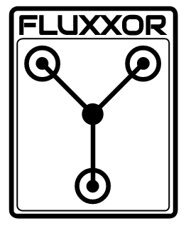

## Express Flux Generator

> [Yeoman](http://yeoman.io) generator that scaffolds out a front-end web app using [gulp](http://gulpjs.com/) for the build process

## Features

* React, A JavaScript library for building user interfaces
* Flux: unidirectional data flow using Fluxxor 
* Server side rendering with React and Express
* Module loading using CommonJs Browserify

## Getting Started

- Install: `npm install -g generator-react-server`
- Run `gulp` to build the client side components with browserify.
- To run the site run node server.js

## License

[MIT license](http://opensource.org/licenses/MIT)

